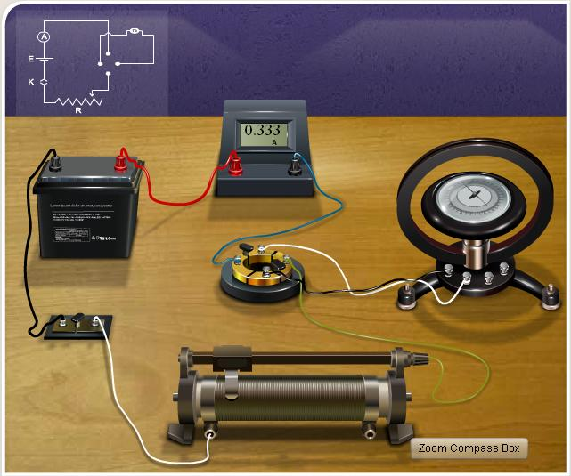

### Procedure
## For performing in the real lab:
Connections are made as shown in the figure given below, where K is the key, E the battery, A the ammeter, R the rheostat, C the commutator, and T.G the tangent galvanometer. The commutator can reverse the current through the T.G coil without changing the current in the rest of the circuit. Taking the average of the resulting two readings for deflection averages out, any small error in positioning the TG coil relative to the earth's magnetic field Bh.

# The initial adjustments are done as follows:
- The plane of the coil is made vertical by adjusting the levelling screws.

- The compass box alone is rotated so that the 90-90 line in the compass box is in the plane of the coil.
 
- The T.G as a whole is rotated till the Aluminium pointer reads 0-0. 
 
- Note down the number of turns in the coil.
 
- A suitable current is allowed to pass through the coil.
 
- Note down the currrent as well as the deflection in T.G.
 
- Reverse the current and note the deflection again.
 
- Repeat the procedure for different values of current.
 
- Measure the radius of the coil from its perimeter.
 
- Determine the reduction factor and horizontal intensity of earth's magnetic field.
 