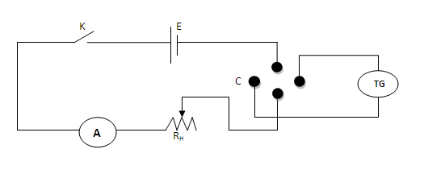

### Procedure
<iframe src="https://www.youtube.com/embed/wIuAnP9xfxw" frameborder="0" allow="autoplay; encrypted-media" allowfullscreen></iframe>

### Apparatus:
Tangent galvanometer (TG), commutator (C), rheostat (R), battery (E), ammeter (A), key (k), etc

## For performing in the real lab:
Connections are made as shown in the figure given below, where K is the key, E the battery, A the ammeter, R the rheostat, C the commutator, and T.G the tangent galvanometer. The commutator can reverse the current through the T.G coil without changing the current in the rest of the circuit. Taking the average of the resulting two readings for deflection averages out, any small error in positioning the TG coil relative to the earth's magnetic field Bh.

### The initial adjustments are done as follows:
- The plane of the coil is made vertical by adjusting the levelling screws.

- The compass box alone is rotated so that the 90-90 line in the compass box is in the plane of the coil.
 
- The T.G as a whole is rotated till the Aluminium pointer reads 0-0. 
 
- Note down the number of turns in the coil.
 
- A suitable current is allowed to pass through the coil.
 
- Note down the currrent as well as the deflection in T.G.
 
- Reverse the current and note the deflection again.
 
- Repeat the procedure for different values of current.
 
- Measure the radius of the coil from its perimeter.
 
- Determine the reduction factor and horizontal intensity of earth's magnetic field.

 ### Procedure for performing simulator
 
<ol>
<li>The <b>Initial set up</b> button helps to adjust the apparatus to be in the magnetic meridian. The apparatus to do the experiment will be fully active only after doing the preliminary adjustment.</li>
<li>A zoomed view of the compass box will be displayed then. Then the slider <b>Rotate compass box</b> will be active. Using this slider, make the 90-90 of the compass box parallel to the plane of the coil.</li>
<li>If this adjustment is correct, the <b>Rotate apparatus</b> slider will become active. Then adjust the slider to make the aluminium pointer reads 0-0.</li>
<li>Now the preliminary adjustments are over. Then go to the whole apparatus set up using the <b>Show normal</b> button provided in the simulator.</li>
<li>Make the connections as shown in the circuit diagram provided in the simulator. The connection wires will appear when a hand symbol appears at the terminals of each component.</li>
<li>When the connections are over, the <b>Insert key</b> button will be active, which enables the user to close the circuit.</li>
<li>Using the combo box <b>Number of turns of the coil</b>, one can select the desired T.G with different number of turns.</li>
<li>The slider <b>Radius of the coil</b> enables one to change the radius of the coil. Then, the current in the coil is adjusted using the slider <b>Adjust rheostat</b>. The corresponding current will be displayed in the ammeter.</li>
<li>For a particular value of current, note the readings on the compass box. The button <b>Zoom Compass Box</b> in the simulator enables the user to view the zoomed view of the compass box. Then reverse the direction of the current through the circuit using the <b>Reverse Current</b> button. Note down the readings.</li>
<li>Repeat the same for different values of current. Then calculate the reduction factor of the tangent galvanometer using the equations provided in the procedure.</li>
<li>To check the obtained result, a <b>Show Result</b> option is provided. On clicking this button, the result will be displayed.</li>
<li><b>Reset</b> button enables the user to reset the whole experimental set up.</li>
</ol>

## Observations and calculations
Number of turns in the coil =....

Circumference of the coil, 2πa=......cm

Radius of the coil, a =....cm

### 1. To determine the horizontal component of earth's magnetic field (Bh): 
he Horizontal component of earth's magnetic field (Bh) can be calculated using the formula, 
$$B_{h}=\frac{\mu_{0}nK}{2a} $$

### 2. To determine the reduction factor of T.G:

<b>Note: Take deflection between 30 and 60 degrees.</b>
### From graph:

Reduction factor K of the tangent galvanometer can be detremined.

From the graph drawn as,
$$K=\frac{AB}{BC}$$

## Result
The reduction factor of the given tangent galvanometer, K  =............A

Horizontal component of eart's magnetic field, Bh =...........T

