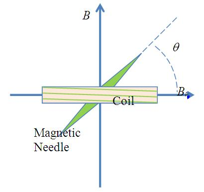
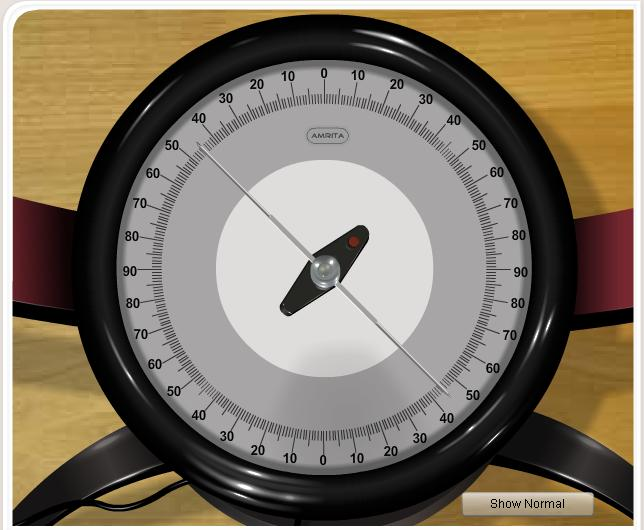

### Principle

When a bar magnet is suspended in two Magnetic fields B and Bh, it comes to rest making an angle θ with the direction of Bh.

<table align="center">
  <tr align="center">
    <td>
      
    </td>
    <td>
      
    </td>
  </tr>
  <tr align="center">
    <td align="centre">
      Figure 1
    </td>
    <td>
      Figure 2
    </td>
  </tr>
</table>

From figure (1) B=Bh tanθ. This is known as tangent law of magnetism.

### Theory
angent galvanometer is an early measuring instrument for small electric currents. It consists of a coil of insulated copper wire wound on a circular non-magnetic frame. Its working is based on the principle of the tangent law of magnetism. When a current is passed through the circular coil, a magnetic field (B) is produced at the center of the coil in a direction perpendicular to the plane of the coil. The TG is arranged in such a way that the horizontal component of earth’s magnetic field (Bh) is in the direction of the plane of the coil. The magnetic needle is then under the action of two mutually perpendicular fields. If θ is the deflection of the needle, then according to tangent law,
$$B=B_{h}\tan\theta .......(1)$$

Let I is the current passing through the coil of radius a with n turns, then the field generated by the current carrying circular coil is,

$$B=\frac{\mu_{0}nI}{2a} .......(2)$$

Equating (1) and (2), we get,

$$B_{h}\tan\theta=\frac{\mu_{0}nI}{2a}.........(3)$$

$$\frac{2aB_{h}}{\mu_{0}n}=\frac{I}{\tan\theta}.........(4)$$

The left hand side of equation (4) is a constant and is called the reduction factor (K) of the given tangent galvanometer.

$$K=\frac{I}{\tan\theta}........(5)$$

Now from equation (3) & (5), the horizontal intensity of earth’s magnetic field Bh is,

$$B_{h}=\frac{\mu_{0}nK}{2a}.........(6)$$

### Applications:
<ol>
<li>T.G can be used to measure the magnitude of the horizontal component of the geomagnetic field.</li>
<li>The principle can be used to compare the galvanometer constants.</li>
</ol>
